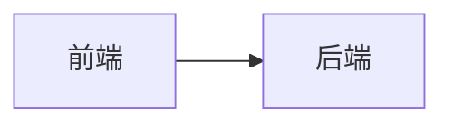
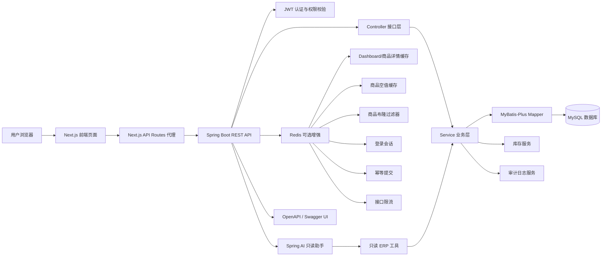
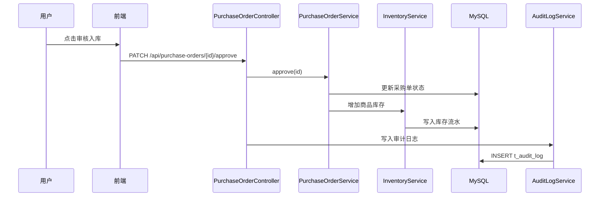
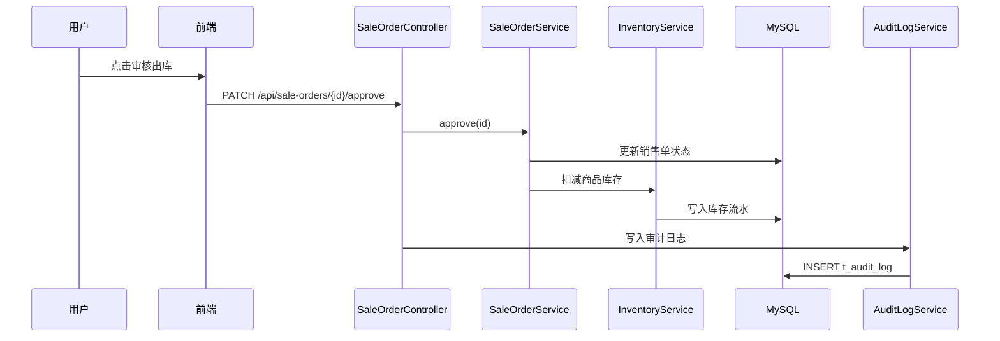

# AsterFlow ERP Architecture

## 1. 系统定位

AsterFlow ERP 是一个面向面试展示的企业级进销存系统，核心目标是管理商品、供应商、客户、采购、销售、库存和审计日志。

这个项目不是单纯的 CRUD 展示，而是围绕真实业务流转设计：

- 采购单审核后，系统自动完成商品入库。
- 销售单审核后，系统自动完成商品出库。
- 每一次库存变化都会记录库存流水。
- 关键业务操作会写入审计日志。
- 高风险操作由管理员权限控制。
- Redis 可选承载缓存、会话、幂等和限流。
- Spring AI 作为只读经营助手生成库存风险和补货建议。
- OpenAPI / Swagger UI 用于接口联调和面试演示。

## 2. Mermaid 图表使用说明

本文件是 Markdown 文档，Mermaid 图表必须写在代码块中：

````markdown

````

如果你把图表复制到 Mermaid 在线编辑器、`.mmd` 文件或某些插件的单图预览里，只复制代码块里面的内容，不要复制外层的三反引号。

也就是说，单独测试时只复制：

```text
flowchart LR
    A["前端"] --> B["后端"]
```

不要复制：

开头的三个反引号加 mermaid，以及结尾的三个反引号。

## 3. 系统架构图

下面这张图是系统架构图，不是顺序图。它展示的是前端、后端、数据库、权限、库存和审计之间的整体关系。



## 4. 后端分层说明

| 层级 | 主要职责 |
| --- | --- |
| controller | 接收 HTTP 请求，做参数校验，返回统一响应 |
| service | 承载核心业务逻辑，例如采购审核、销售审核、库存调整 |
| mapper | 使用 MyBatis-Plus 操作数据库 |
| entity | 数据库表对应的实体对象 |
| dto | 前后端交互的数据对象 |
| enums | 订单状态、库存变化类型、商品状态等枚举 |
| config | OpenAPI、WebMvc、拦截器等配置 |
| util | JWT、权限校验等工具类 |
| ai | Spring AI 只读工具 |

## 5. 采购入库顺序图

下面这张图是顺序图，也叫时序图。它展示一次“采购审核入库”从前端到后端、服务层、数据库和审计日志的调用顺序。



## 6. 销售出库顺序图

下面这张图也是顺序图。它展示一次“销售审核出库”如何完成库存扣减和审计记录。



## 7. 数据可追溯设计

系统使用两类记录保证业务可追溯。

| 表 | 作用 |
| --- | --- |
| t_stock_record | 记录每一次库存变化，包括入库、出库、调整和回滚 |
| t_audit_log | 记录关键操作，包括操作人、操作类型、业务对象、描述和时间 |

通过这两张表，系统可以回答企业系统中很重要的问题：

- 库存为什么变化？
- 是哪个业务单据导致的？
- 是谁操作的？
- 什么时间操作的？
- 操作是否可以被追踪和复盘？

## 8. 权限设计

系统使用 JWT 做登录认证。

用户登录成功后，前端保存 token。后续请求接口时，前端通过 `Authorization` 请求头把 token 传给后端。

后端通过拦截器解析 token，并识别当前用户身份和角色。

高风险操作必须由后端做最终权限控制，例如：

- 删除客户
- 启用或停用供应商
- 删除草稿采购单
- 删除草稿销售单
- 停用商品

前端隐藏按钮只是提升用户体验，真正的安全控制必须放在后端。

## 9. OpenAPI 与 Swagger UI

项目接入 OpenAPI，是为了自动生成后端接口文档。

Swagger UI 是 OpenAPI 文档的网页展示工具。启动后端后，可以通过浏览器查看接口列表、请求参数和响应结构。

在面试中可以这样说明：

> 我接入 OpenAPI 和 Swagger UI，是为了让接口具备可视化文档能力，方便前后端联调，也方便面试时展示后端 API 设计。

## 10. 测试策略

项目使用集成测试覆盖关键业务流程：

- 采购审核后库存增加
- 采购取消后库存回滚
- 销售审核后库存扣减
- 销售取消后库存恢复
- 手动库存调整写入库存流水
- 关键操作写入审计日志
- 缺少 JWT 会被拒绝
- 普通员工不能执行管理员操作
- 非法请求体返回统一校验错误
- Redis 限流异常时主流程可降级
- 商品详情缓存命中时不查数据库
- 不存在商品会写入短 TTL 空值缓存
- 布隆过滤器判断商品 ID 不可能存在时不查数据库
- AI 工具只读调用现有业务服务
- OpenAPI 文档可以正常生成

这些测试保证业务闭环不是页面演示，而是后端逻辑真实可靠。

## 11. Spring AI 只读助手

项目已经接入 Spring AI 作为只读经营助手。当前接口是：

```text
GET /api/ai/inventory-advice
```

当前设计原则：

- AI 不直接操作数据库。
- AI 不直接调用 Mapper。
- AI 通过 `InventoryAiTools` 读取现有业务服务。
- Prompt 要求只根据系统提供的 ERP 数据回答。
- 模型失败时返回结构化兜底建议，不影响采购、销售、库存等主流程。

当前可用于分析的数据包括：

- 查询库存预警
- 查询 Dashboard 汇总
- 生成补货建议

后续可以继续扩展更多只读工具，例如近期采购/销售趋势、商品库存流水和审计异常摘要。关键动作仍然必须走原有权限体系，避免智能功能绕过业务规则。

这样 Spring AI 不是外挂功能，而是建立在现有 ERP 业务能力之上的智能助手。

## 12. Redis 可选增强

Redis 在项目中是可选增强，不是业务数据源。MySQL 仍然负责订单、库存和流水的最终一致性。

当前 Redis 能力：

- `ERP_CACHE_TYPE=redis`：Dashboard 汇总缓存、商品详情缓存、商品空值缓存、商品布隆过滤器。
- `ERP_AUTH_SESSION_STORE=redis`：认证会话存储。
- `ERP_IDEMPOTENCY_STORE=redis`：幂等提交 Key 存储。
- `ERP_RATE_LIMIT_ENABLED=true`：Redis Lua 计数限流。

默认本地开发使用 local 模式，避免没有 Redis 时无法启动或测试。后续可以继续补热点 Key 重建和真实 Redis 集成验证。
