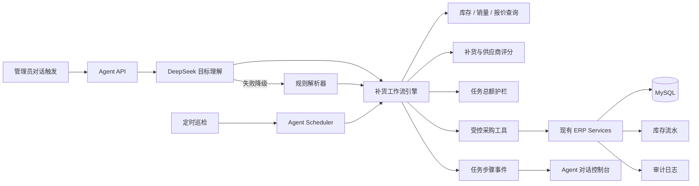
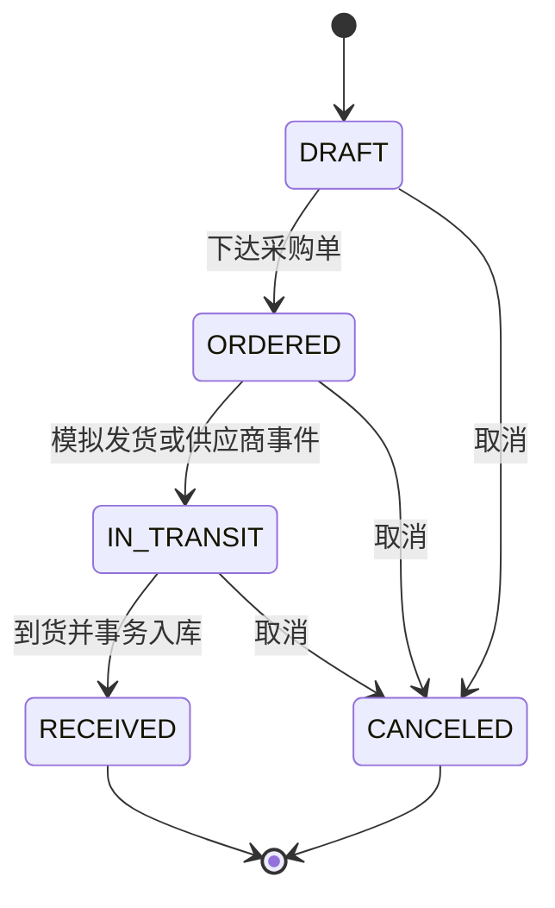

# AsterFlow ERP 自主补货 Agent 设计

日期：2026-07-20  
状态：已完成交互式设计评审，等待书面规格确认

## 1. 背景

AsterFlow ERP 已具备商品、供应商、采购、销售、库存流水、Dashboard、JWT 权限与审计日志等业务能力，但智能化仍停留在路线文档中。第一阶段 Agent 不做通用聊天，也不直接访问数据库，而是在现有 ERP Service 之上完成一条可演示、可复算、可恢复的自主补货闭环。

目标用户通过对话或定时任务下达经营目标后，系统应自动分析库存与销量、计算补货缺口、比较供应商报价、创建并下达采购单、模拟运输和到货入库，并输出完整执行报告。正常任务不需要人工确认；整次任务采购总额超过单次金额上限或发生不可恢复异常时暂停。

## 2. 目标与非目标

### 2.1 目标

- 提供对话触发和定时巡检两种入口。
- 使用 DeepSeek 理解目标、选择任务、调用受控工具和生成业务解释。
- 使用确定性 Java 工作流执行补货计算、供应商评分、金额护栏、状态迁移、幂等和恢复。
- 在 DeepSeek 不可用时自动切换规则解析器，补货主流程仍可执行。
- 增加供应商商品报价数据，使供应商选择有真实依据。
- 将采购流程升级为草稿、已下单、运输中、已到货的真实生命周期。
- 保证所有写操作复用现有业务 Service，并生成库存流水和审计记录。
- 提供对话优先的 Agent 控制台，持续显示执行步骤、预计金额、护栏状态和计划任务。

### 2.2 非目标

- 第一阶段不实现销售履约 Agent、异常经营纠正 Agent 或多个 Agent 协作。
- 不让模型生成或执行 SQL，不向模型暴露 Mapper 或数据库连接。
- 不由模型直接决定采购数量、金额、状态迁移或权限。
- 不实现真实供应商下单接口、物流接口、付款和采购退货。
- 不保存或展示模型的隐藏思维链，只保存业务事实、工具参数摘要和结果摘要。
- 不在自动化测试中调用真实 DeepSeek API。

## 3. 已确认的产品决策

- Agent 类型：通用 ERP Agent 的第一条能力采用自主补货。
- 自动化级别：正常情况下全自动执行，异常时暂停。
- 供应商数据：新增供应商—商品报价模型。
- 触发方式：同时支持人工对话和定时巡检。
- 采购生命周期：只有已到货才增加库存；演示环境可自动模拟运输与到货。
- 模型策略：DeepSeek 为主要模型，没有模型时使用确定性规则降级。
- 补货计算：确定性算法计算，DeepSeek 负责编排和解释。
- 风险控制：只配置整次任务采购总额上限；超限任务暂停。
- 页面布局：对话优先，运行信息置于右侧栏，详细时间线进入任务详情。
- 执行身份：人工任务继承当前登录用户；定时任务使用 `SYSTEM_AGENT`。
- 核心架构：确定性工作流内核与 DeepSeek Agent 组合，而非模型直接控制写操作。

## 4. 总体架构



### 4.1 职责边界

- `Agent API`：接收目标、校验管理员权限、创建任务并返回任务编号。
- `DeepSeek 目标理解`：把自然语言转成结构化 `ReplenishmentGoal`，决定使用查询、预览或执行能力，并生成用户可读解释。
- `规则解析器`：模型超时、无余额、不可用或结构化响应无效时，根据固定目标模板启动同一工作流。
- `补货工作流引擎`：持久化任务状态，执行确定性计算、护栏、幂等、重试、暂停和恢复。
- `ERP Tools`：将模型能力限制在已注册工具内。唯一写工具只负责启动受控工作流，不能直接修改数据库。
- `现有 ERP Services`：继续负责采购、库存、权限和事务规则，是唯一业务写入口。
- `Agent 控制台`：显示业务事实和执行进度，不展示隐藏思维链。

## 5. DeepSeek 与 Spring AI 接入

项目使用 Spring AI 2.0.0 的 OpenAI Chat 接口适配 DeepSeek 的 OpenAI 兼容 API。

建议配置：

```yaml
erp:
  ai:
    enabled: ${ERP_AI_ENABLED:true}
    provider: deepseek
    fallback-enabled: true

spring:
  ai:
    openai:
      base-url: ${DEEPSEEK_BASE_URL:https://api.deepseek.com}
      api-key: ${DEEPSEEK_API_KEY:}
      chat:
        model: ${DEEPSEEK_MODEL:deepseek-v4-flash}
```

约束如下：

- 密钥只能来自 `DEEPSEEK_API_KEY` 环境变量，不写入代码、数据库、日志或版本库。
- 默认使用 `deepseek-v4-flash`，可通过环境变量切换 `deepseek-v4-pro`。
- 不采用计划于 2026-07-24 弃用的 `deepseek-chat` 和 `deepseek-reasoner` 旧名称。
- 只使用 DeepSeek 与 Spring AI 都支持的 Chat Completions、结构化输出和 Tool Calls 公共能力。
- 发送给模型的数据只包含商品编号、名称、聚合销量、库存、报价、交期和评分，不发送供应商联系方式、用户隐私或系统密钥。
- 结构化目标和工具参数必须在 Java 侧再次校验。

### 5.1 注册工具

- `query_inventory_risks`：查询启用商品的库存风险、最低库存和在途数量。
- `query_sales_demand`：查询指定窗口内的净销售出库量。
- `query_supplier_quotes`：查询指定商品的有效供应商报价。
- `preview_replenishment`：调用确定性算法生成计划快照，不产生业务写入。
- `execute_replenishment_task`：唯一写工具，启动或恢复受控补货工作流。
- `get_agent_task_status`：查询任务、采购单和到货进度。

人工对话可以由 DeepSeek选择并调用这些工具。定时巡检直接启动相同工作流，完成后再调用 DeepSeek 生成经营报告；模型不可用不会阻断定时补货。

## 6. 数据模型

### 6.1 供应商商品报价 `t_supplier_product_quote`

| 字段 | 含义 |
| --- | --- |
| id | 主键 |
| supplier_id | 供应商 ID |
| product_id | 商品 ID |
| purchase_price | 当前采购价 |
| lead_time_days | 预计交付天数 |
| min_order_quantity | 最小起订量 |
| quality_score | 质量评分，0 到 100 |
| preferred | 是否首选供应商，仅用于同分决胜 |
| status | ACTIVE / INACTIVE |
| version | 乐观锁版本 |
| created_at / updated_at | 创建与更新时间 |

唯一约束为 `(supplier_id, product_id)`。只使用启用供应商和启用报价。

### 6.2 Agent 任务 `t_agent_task`

| 字段 | 含义 |
| --- | --- |
| id / task_no | 主键和可展示任务编号 |
| task_type | 第一阶段固定为 REPLENISHMENT |
| trigger_type | MANUAL / SCHEDULED |
| goal | 用户目标或定时任务目标 |
| status | 任务状态 |
| requested_by_id / requested_by_name | 人工触发用户；定时任务为空 |
| executor_id / executor_name / executor_role | 实际执行身份 |
| model_provider / model_name | 本次使用的模型 |
| fallback_used | 是否使用规则降级 |
| idempotency_key | 防止重复提交的唯一键 |
| amount_limit / planned_amount | 本次上限和计划总额快照 |
| error_code / error_message | 可展示错误，不保存密钥或敏感内容 |
| started_at / completed_at | 执行时间 |

任务状态为：

- `PENDING`：已创建，尚未执行。
- `RUNNING`：正在计算或创建采购单。
- `PAUSED_LIMIT`：计划总额超过本次上限，未创建采购单。
- `WAITING_DELIVERY`：采购单已下达，等待运输或到货。
- `SUCCEEDED`：全部计划项完成到货。
- `COMPLETED_WITH_WARNINGS`：可执行项完成，但部分商品因无有效报价等原因被跳过。
- `FAILED`：不可恢复失败。
- `CANCELED`：任务被管理员取消。

### 6.3 Agent 任务步骤 `t_agent_task_step`

保存阶段、工具名、输入摘要、结果摘要、状态、重试次数、开始时间、结束时间和错误信息。工具完整输入输出如需保存，应先删除敏感字段并限制长度。不保存隐藏思维链。

### 6.4 补货计划项 `t_replenishment_plan_item`

每个商品保存：

- 任务 ID、商品 ID、选择的供应商 ID。
- 销量窗口、净销量、日均销量。
- 当前库存、在途数量、最低库存、安全天数和交付周期。
- 目标库存、原始缺口、MOQ 修正后的建议采购量。
- 采购价、预计金额、供应商各评分项和最终得分。
- 计划项状态、跳过原因和生成的采购单 ID。

这些字段是计算时的业务快照，保证计划在数据变化后仍可解释和复算。

### 6.5 Agent 策略 `t_agent_policy`

保存唯一一条当前策略记录：策略版本、定时开关、Cron 表达式、整次任务金额上限、销量窗口天数、安全天数、到货模拟开关、更新时间和更新人。每次更新策略都递增版本；定时任务幂等键包含策略版本，任务创建时复制策略值作为不可变快照。

### 6.6 采购单扩展

在 `t_purchase_order` 增加：

- `agent_task_id`
- `ordered_at`
- `shipped_at`
- `expected_arrival_at`
- `received_at`

对 Agent 自动创建的采购单增加 `(agent_task_id, supplier_id)` 唯一约束，保证同一任务对同一供应商不会重复建单。人工采购单的 `agent_task_id` 为空，不受该约束影响。

## 7. 采购状态机



- `DRAFT → ORDERED` 不改变库存。
- `ORDERED → IN_TRANSIT` 记录发货时间。
- `IN_TRANSIT → RECEIVED` 在同一个事务中完成条件状态更新、库存增加和库存流水写入。
- `DRAFT`、`ORDERED`、`IN_TRANSIT` 可以取消，取消时不产生反向库存。
- `RECEIVED` 不允许直接取消；采购退货不在第一阶段范围内。
- 现有 `APPROVED` 采购单已经完成入库，数据库迁移时统一映射为 `RECEIVED`，不能再次触发入库。

演示环境开启 `erp.agent.delivery-simulation-enabled` 后，可按报价中的交付周期自动推进运输和到货。生产配置默认关闭模拟，未来接入真实到货事件。

## 8. 补货算法

### 8.1 有效销量

销量窗口默认 30 天。有效销量使用现有库存流水计算销售净出库：销售出库量减去销售取消产生的回补量。这样无需依赖订单更新时间，也不会把已取消销售单计入真实需求。

```text
dailyAverageSales = max(0, netSaleOutboundQuantity) / lookbackDays
```

### 8.2 目标库存与采购量

安全天数默认 7 天。

```text
targetStock = max(
    minStock,
    ceil(dailyAverageSales * (leadTimeDays + safetyDays))
)

rawShortage = max(0, targetStock - currentStock - inTransitQuantity)

recommendedQuantity =
    rawShortage == 0
        ? 0
        : max(rawShortage, minOrderQuantity)
```

在途数量只统计 `ORDERED` 和 `IN_TRANSIT` 采购单，草稿和已取消订单不计入。

### 8.3 供应商评分

先过滤以下候选：供应商启用、报价启用、采购价大于零、交付周期非负、MOQ 大于零。随后在同一商品的候选集合中归一化评分：

```text
supplierScore = priceScore * 0.50
              + leadTimeScore * 0.25
              + qualityScore * 0.25
```

采购价越低、交付周期越短、质量评分越高，最终分数越高。`preferred` 只用于同分决胜，之后按供应商 ID 保证排序稳定。DeepSeek 可以解释结果，但不能覆盖算法选出的供应商。

## 9. 执行流程

1. 人工对话或定时器创建任务和幂等键。
2. 人工任务校验当前用户为管理员；定时任务创建 `SYSTEM_AGENT` 执行上下文。
3. DeepSeek 将人工目标转成结构化目标；失败时使用规则解析器。
4. 工作流读取库存、有效销量、在途采购和有效报价的一致业务快照。
5. 对每个风险商品计算目标库存、采购缺口和供应商得分。
6. 无有效报价或商品已停用的计划项标记为跳过并记录告警。
7. 保存全部计划项和计算快照，汇总整次任务采购总额。
8. 总额超过任务金额上限时，将任务置为 `PAUSED_LIMIT`，不创建任何采购单。
9. 总额未超限时，按供应商分组，通过现有采购 Service 创建草稿并下达为 `ORDERED`。
10. 任务进入 `WAITING_DELIVERY`。演示调度器按交付周期推进为 `IN_TRANSIT` 和 `RECEIVED`。
11. 每个采购单到货时事务入库并写库存流水、审计日志和任务步骤。
12. 所有采购单完成后，任务进入 `SUCCEEDED` 或 `COMPLETED_WITH_WARNINGS`，DeepSeek 生成业务报告；模型不可用时由模板生成报告。

## 10. 幂等、并发与恢复

- 定时任务幂等键使用 `AUTO_REPLENISH:{businessDate}:{policyVersion}`，同一业务日和策略版本只创建一次。
- 人工任务由前端生成请求幂等键；网络重试复用相同键。
- 数据库唯一约束是最终幂等保障，不依赖可选 Redis。
- 同一任务的供应商订单使用 `(agent_task_id, supplier_id)` 去重。
- 到货使用 `WHERE status = IN_TRANSIT` 的条件更新，并与库存入库和流水写入处于同一事务。
- DeepSeek 超时、无余额、不可用或返回无效结构时立即降级，不重试写工具。
- 可判定为瞬时的数据库或网络异常最多重试 3 次，采用指数退避。
- 任务在进程重启后从持久化状态继续，不重新计算已经冻结的计划快照。
- 无报价、停用商品等单项业务问题只跳过该项；数据库一致性错误等系统问题使任务失败。
- 总额超限时不允许先创建部分订单。管理员可以为该任务设置一次性金额上限并恢复，恢复操作进入审计日志。

## 11. 身份与权限

- 第一阶段 Agent 页面和自主写任务仅对 `ADMIN` 开放。
- 人工任务的 `requested_by` 和 `executor` 都记录当前管理员。
- 定时任务的 `requested_by` 为空，`executor` 使用专用 `SYSTEM_AGENT` 身份。
- `SYSTEM_AGENT` 不能通过登录接口获取 JWT，只能由内部调度器创建受限执行上下文。
- `SYSTEM_AGENT` 只允许调用自主补货工作流所需能力，不获得通用管理员接口权限。
- 所有采购单、库存流水、任务步骤和审计记录都能通过 `agent_task_id` 或任务编号关联。

## 12. API 设计

### 12.1 Agent 任务

- `POST /api/agent/tasks`：提交 `{ goal, idempotencyKey }`，返回 `202 Accepted` 和任务编号。
- `GET /api/agent/tasks`：分页查询任务历史。
- `GET /api/agent/tasks/{taskNo}`：返回任务、计划项、采购单和异常摘要。
- `GET /api/agent/tasks/{taskNo}/events`：SSE 推送步骤状态变化。
- `POST /api/agent/tasks/{taskNo}/resume`：管理员提交该任务的一次性金额上限并恢复。
- `POST /api/agent/tasks/{taskNo}/cancel`：取消尚未到货完成的任务。

### 12.2 策略与报价

- `GET /api/agent/policy`：读取定时开关、执行时间、金额上限、销量窗口和安全天数。
- `PUT /api/agent/policy`：管理员更新策略并增加策略版本。
- `/api/supplier-product-quotes`：提供报价分页、新增、编辑、启停接口。

## 13. 前端体验

新增 `/agent` 页面，采用对话优先布局：

- 左侧主区域显示用户目标、Agent 回复和逐步执行事件。
- 右侧显示当前状态、预计总额、金额护栏、使用模型或规则模式、下次巡检时间。
- 用户提交目标后不弹出确认框；符合金额上限时自动执行。
- 每个步骤显示业务事实，例如查询到的风险商品数量、计划采购数量、选中供应商和生成的采购单。
- 成功回复包含采购总额、商品数量、供应商选择摘要和采购单详情链接。
- 降级时显示“规则模式”，不把降级描述为失败。
- 超限时显示暂停卡片。管理员可以调整该任务的一次性金额上限并恢复，或取消任务。
- 任务详情页展示完整时间线、计划计算快照、工具摘要、采购单和审计记录。
- 页面刷新后从任务详情接口恢复状态，再重新连接 SSE，不能丢失任务进度。

## 14. 错误处理

| 场景 | 行为 |
| --- | --- |
| DeepSeek 无 Key、超时、无余额或不可用 | 标记 `fallback_used`，规则解析器继续 |
| DeepSeek 返回无效工具参数 | Java 校验拒绝，转规则工作流，不执行原参数 |
| 整次任务总额超限 | 保存计划，置为 `PAUSED_LIMIT`，不创建采购单 |
| 商品没有有效报价 | 跳过商品并告警，其他商品继续 |
| 商品或供应商执行前被停用 | 重新校验并跳过对应计划项 |
| 创建某供应商订单瞬时失败 | 幂等重试，已经成功的订单不重复创建 |
| 到货事件重复 | 条件状态更新返回 0，不重复入库 |
| 数据库事务失败 | 本次状态更新、库存和流水全部回滚 |
| 服务重启 | 扫描未完成任务并从持久化步骤恢复 |

## 15. 测试策略

### 15.1 单元测试

- 日均销量、目标库存、在途扣减和 MOQ 修正。
- 价格、交期、质量评分归一化和稳定决胜。
- 总额护栏与单任务一次性上限。
- 任务状态机和采购状态机的合法、非法迁移。
- 结构化目标校验和规则解析降级。

### 15.2 集成测试

- 人工目标完成计划、按供应商分单和下单。
- 定时任务使用 `SYSTEM_AGENT` 并生成正确审计信息。
- 同一幂等键重复提交只生成一个任务。
- 同一任务重试不重复创建供应商订单。
- 超限任务不创建任何采购单，调整单任务上限后可恢复。
- 无报价商品被跳过，任务以警告状态完成。
- 模拟运输按状态推进，只有 `RECEIVED` 才入库。
- 重复到货事件不重复增加库存或写流水。
- 旧 `APPROVED` 数据迁移为 `RECEIVED` 后不会再次入库。
- DeepSeek 客户端异常和无效响应都会切换规则模式。

### 15.3 前端测试

- 提交目标后显示任务编号和实时步骤。
- SSE 断开后重连，刷新后从后端恢复任务状态。
- 规则模式、超限暂停、单项告警和系统失败具有不同提示。
- 超限恢复和策略配置只对管理员显示。
- 成功报告可以跳转到生成的采购单和库存流水。

所有自动化测试使用固定模型桩，不访问真实 DeepSeek API。真实 API 只用于受控的手动联调。

## 16. 验收标准

1. 管理员输入“检查库存并自动完成今日补货”后，系统无需人工确认即可完成范围内任务。
2. 计划中的采购数量可以使用保存的快照和公式重新计算，结果一致。
3. 供应商选择可以显示价格、交期、质量评分和最终得分，不依赖模型臆测。
4. 整次任务总额超限时没有任何采购单被创建。
5. DeepSeek 不可用时任务仍能通过规则模式完成。
6. 重复提交、任务恢复和重复到货不会导致重复采购或重复入库。
7. 库存只在采购单进入 `RECEIVED` 时增加，并生成库存流水。
8. 人工任务和定时任务分别记录当前管理员和 `SYSTEM_AGENT` 身份。
9. 对话页面可以展示实时步骤、降级状态、异常暂停和最终报告。
10. 后端测试、前端构建和新增测试全部通过，密钥不出现在代码、日志和提交内容中。

## 17. 官方资料

- Spring AI OpenAI Chat：<https://docs.spring.io/spring-ai/reference/api/chat/openai-chat.html>
- Spring AI Tool Calling：<https://docs.spring.io/spring-ai/reference/api/tools.html>
- Spring AI Structured Output：<https://docs.spring.io/spring-ai/reference/api/structured-output-converter.html>
- DeepSeek API 入门：<https://api-docs.deepseek.com/zh-cn/>
- DeepSeek Tool Calls：<https://api-docs.deepseek.com/zh-cn/guides/tool_calls>
